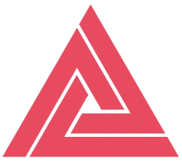

  
<h1 style="font-size: 1.8rem; font-weight: bold; color: #000;">Tech Enerzal   &nbsp; </h1>

## About Us

**Tech Enerzal** is a team of passionate students from **Thakur College of Engineering and Technology (TCET)**, affiliated with **Mumbai University**. Based out of **Mumbai, India**, we are a dynamic group interested in fields such as **Machine Learning (ML)**, **Deep Learning (DL)**, **Natural Language Processing (NLP)**, **MLOps**, **Cloud Deployment**, **UI/UX**, and **Full Stack Development**. Our team is committed to developing impactful AI solutions that can be deployed on the cloud, integrated with full-stack applications, and enriched with cutting-edge AI/ML models.

---

## 📁 Projects

| **Project Name**                   | **Description**                                                                  | **Assigned Members**                      |
|------------------------------------|---------------------------------------------------------------------------------|--------------------------------------------|
| **Organizational Chatbot (GAIL)**  | AI-based chatbot designed for GAIL company to manage HR, IT, and event queries. | All 6 Members                              |
| **Organizational Chatbot (Intel)** | AI chatbot developed for Intel Hackathon focusing on enterprise solutions.      | Member 1, Member 2, Member 3               |

---

## 🧑‍💻 Our Team

|  **GitHub** |  **LinkedIn** | **Name**  | **Role & Expertise**               |
|-----------------------------------------|----------------------------------------------|-------------------------|------------------------------------|
| [@member1](https://github.com/member1)  | [LinkedIn](https://linkedin.com/in/member1)  | **Member 1**             | **AI/ML Researcher**   Specializes in NLP and MLOps. |
| [@member2](https://github.com/member2)  | [LinkedIn](https://linkedin.com/in/member2)  | **Member 2**             | **Cloud Architect**   Expert in cloud deployment & AI scaling. |
| [@member3](https://github.com/member3)  | [LinkedIn](https://linkedin.com/in/member3)  | **Member 3**             | **MLOps Engineer**   Focuses on CI/CD and automation for ML models. |
| [@member4](https://github.com/member4)  | [LinkedIn](https://linkedin.com/in/member4)  | **Member 4**             | **Backend Developer**   Specializes in API integration and backend systems. |
| [@member5](https://github.com/member5)  | [LinkedIn](https://linkedin.com/in/member5)  | **Member 5**             | **UI/UX Designer**   Focused on creating user-friendly interfaces for AI. |
| [@member6](https://github.com/member6)  | [LinkedIn](https://linkedin.com/in/member6)  | **Member 6**             | **Full Stack Developer**   Experienced in building AI-integrated platforms. |

---

## 🌐 Social Links

- **GitHub Organization**: [Tech Enerzal GitHub](https://github.com/TechEnerzal)
- **LinkedIn**: [Tech Enerzal LinkedIn](https://linkedin.com/company/techenerzal)

---

## 🛠️ Tech Stack

- **Machine Learning**: Python, TensorFlow, PyTorch
- **MLOps**: Docker, Kubernetes, CI/CD
- **Cloud**: AWS, GCP, Azure
- **Frontend**: HTML, CSS, JavaScript, React
- **Backend**: Flask, Django, Node.js
- **Databases**: MongoDB, PostgreSQL, MySQL

---

We are constantly working on exciting projects and expanding our knowledge in the AI/ML space. Follow our progress and check out our repositories for cutting-edge solutions!

